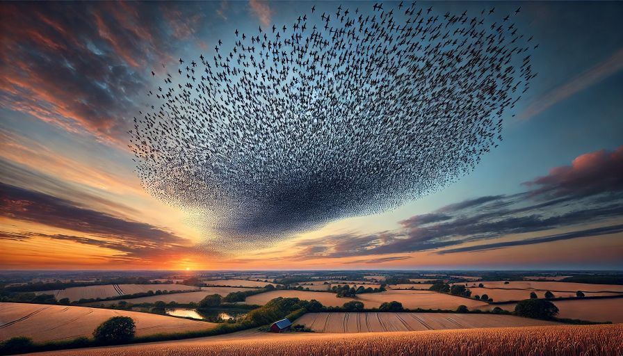

# Murmuration



## Overview

Murmuration is an interactive web application that simulates the mesmerizing flocking behavior of starlings in flight. The application offers a customizable, visually stunning representation of bird flocks, with physically accurate movement patterns based on the Boids algorithm.

### Key Features

- **Real-time Simulation**: Experience the beauty of starling murmurations with realistic flocking behaviors
- **Customizable Parameters**: Control flock size, speed, cohesion, alignment, and separation
- **Text & Symbol Formation**: Watch as birds transition from natural flocking to form text or symbols
- **High Performance**: Optimized rendering for smooth animation even with thousands of birds
- **Beautiful Visuals**: Stunning visual effects with customizable appearance

## Project Structure

This repository contains:

- Technical specifications in [TECHNICAL_SPECIFICATIONS.md](./TECHNICAL_SPECIFICATIONS.md)
- Development plan in [DEVELOPMENT_PLAN.md](./DEVELOPMENT_PLAN.md)
- Source code (coming soon)

## Getting Started

### Prerequisites

- Modern web browser with WebGL support
- Node.js and npm (for development)

### Installation

```bash
# Clone the repository
git clone https://github.com/yourusername/murmuration.git

# Navigate to the project directory
cd murmuration

# Install dependencies
npm install

# Start the development server
npm run dev
```

## How It Works

Murmuration uses the Boids algorithm (by Craig Reynolds) to simulate flocking behavior based on three simple rules:

1. **Separation**: Birds avoid crowding their neighbors
2. **Alignment**: Birds steer towards the average heading of their neighbors
3. **Cohesion**: Birds move toward the average position of their neighbors

For the text/symbol formation feature, we implement a force-based targeting system that gradually guides birds to form shapes while maintaining natural-looking movement.

## Contributing

Contributions are welcome! Please feel free to submit a Pull Request.

## License

This project is licensed under the MIT License - see the LICENSE file for details.

## Acknowledgments

- Craig Reynolds for the original Boids algorithm
- The natural world for inspiring this digital recreation